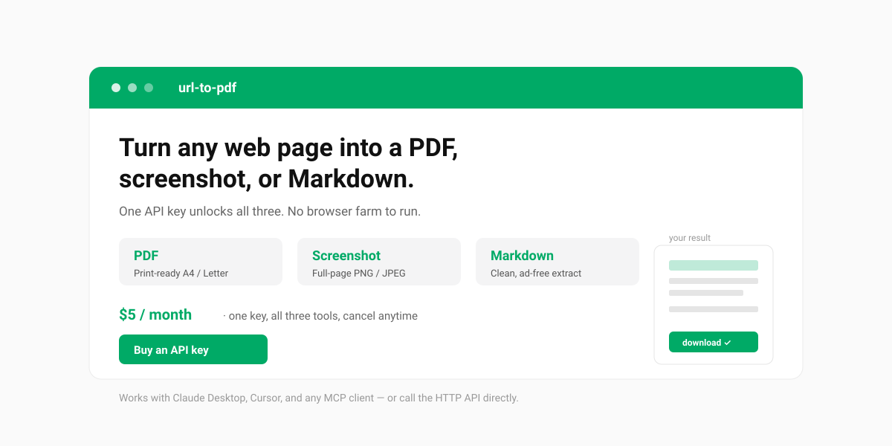

# url-to-pdf

**Turn any public web page into a PDF, a full-page screenshot, or clean Markdown — with one API key.**

No browser farm to run, no headless Chrome to babysit. `url-to-pdf` renders pages on Cloudflare's infrastructure and hands you a download link. Use it from any MCP-compatible AI client (Claude Desktop, Cursor, and friends) by just talking, or call the HTTP API directly from your scripts.



---

## Why you'll like it

- **Four outputs, one key.** PDF (A4 / Letter / Legal, portrait or landscape), full-page PNG/JPEG screenshots, clean Markdown (navigation stripped out), and structured JSON (title, description, canonical URL, language, main text, links).
- **Your assistant actually sees the result.** Small outputs (≤1 MB) are returned inline — screenshots come back as images the model can look at, not just a link it has to read out loud.
- **Every render comes with a receipt.** Final URL after redirects, HTTP status, capture time, duration, byte size and a SHA-256 of the artifact, so a result can be quoted and verified later.
- **Just talk to it.** Connect it as an MCP server and say *"turn https://example.com into a PDF"* — your client does the rest. No curl, no JSON to hand-write.
- **Also a plain HTTP API.** Every tool is a single `POST` with your `x-api-key`. Great for scripts, backends, and low-code platforms.
- **Mobile, retina and dark mode.** Set any viewport (320–3840 × 240–2160), device pixel ratio up to 3, and render with `prefers-color-scheme: dark`.
- **SSRF-protected.** Only public `http(s)` URLs are accepted; internal and reserved addresses are rejected at the edge.
- **Private by design.** Outputs are kept for **1 hour** then auto-deleted. We never see your card (Paddle handles payments) and your email is used only to recover your key.

---

## Get your API key

1. Go to **[url-pdf.hammbox.com/buy](https://url-pdf.hammbox.com/buy)** and complete checkout (Paddle — major credit cards).
2. **Your key appears on screen the moment payment completes.** Copy it and keep it safe.
3. Lost it? Recover it anytime at **[/portal/claim](https://url-pdf.hammbox.com/portal/claim)** with the email you used at checkout. No password, no support ticket.

---

## Use it as an MCP server (recommended for AI clients)

Add `url-to-pdf` to your client's MCP configuration. With Claude Desktop, Cursor, or any client that supports **Streamable HTTP**:

```json
{
  "mcpServers": {
    "url-to-pdf": {
      "type": "http",
      "url": "https://url-pdf.hammbox.com/mcp",
      "headers": { "x-api-key": "YOUR_API_KEY" }
    }
  }
}
```

That's it — no local install. Then just ask your assistant in natural language:

> *"Convert https://news.ycombinator.com to a PDF and give me the download link."*

The client calls the tool, passes your key, and shows you the result.

---

## Use it as an HTTP API (for scripts & backends)

Every render is a `POST` to a `/tools/*` endpoint with your key in the header.

```bash
# Web page → PDF
curl -X POST https://url-pdf.hammbox.com/tools/url-to-pdf \
  -H "Content-Type: application/json" \
  -H "x-api-key: YOUR_API_KEY" \
  -d '{"url":"https://example.com","format":"A4"}'

# Full-page screenshot
curl -X POST https://url-pdf.hammbox.com/tools/url-to-screenshot \
  -H "Content-Type: application/json" \
  -H "x-api-key: YOUR_API_KEY" \
  -d '{"url":"https://example.com","fullPage":true,"format":"png"}'

# Extract Markdown
curl -X POST https://url-pdf.hammbox.com/tools/url-to-markdown \
  -H "Content-Type: application/json" \
  -H "x-api-key: YOUR_API_KEY" \
  -d '{"url":"https://example.com"}'

# Structured data as JSON
curl -X POST https://url-pdf.hammbox.com/tools/url-to-extract \
  -H "Content-Type: application/json" \
  -H "x-api-key: YOUR_API_KEY" \
  -d '{"url":"https://example.com","maxLinks":50}'

# Mobile screenshot, retina, dark mode
curl -X POST https://url-pdf.hammbox.com/tools/url-to-screenshot \
  -H "Content-Type: application/json" \
  -H "x-api-key: YOUR_API_KEY" \
  -d '{"url":"https://example.com","width":390,"height":844,"deviceScaleFactor":2,"darkMode":true,"blockAds":true}'
```

The response includes a `downloadUrl` valid for **1 hour**:

```json
{
  "downloadUrl": "https://url-pdf.hammbox.com/f/pdf/<id>.pdf",
  "contentType": "application/pdf",
  "sizeBytes": 456494,
  "title": "Example Domain",
  "ttlSeconds": 3600,
  "meta": { "format": "A4", "landscape": false },
  "receipt": {
    "renderId": "<uuid>",
    "url": "https://example.com",
    "finalUrl": "https://example.com/",
    "capturedAt": "2026-10-09T06:20:11.482Z",
    "durationMs": 2140,
    "bytes": 456494,
    "sha256": "9f2c…",
    "format": "pdf",
    "httpStatus": 200
  }
}
```

Over MCP, artifacts of 1 MB or less are additionally returned **inline** next to the JSON above — as an `image` content block for screenshots, or an embedded resource for PDF / Markdown / JSON.

```bash
curl -O "<downloadUrl>"
```

---

## Tools & parameters

| MCP tool | HTTP endpoint | What it does |
|---|---|---|
| `list_capabilities` *(free)* | `GET /openapi.json` | Lists capabilities, prices, and where to buy a key |
| `url_to_pdf` | `POST /tools/url-to-pdf` | Render a page to PDF |
| `url_to_screenshot` | `POST /tools/url-to-screenshot` | Capture a full-page screenshot |
| `url_to_markdown` | `POST /tools/url-to-markdown` | Extract the page as clean Markdown |
| `url_to_extract` | `POST /tools/url-to-extract` | Structured JSON: title, description, canonical, language, main text, links |

**`url_to_pdf`** — `url` *(required)*, `format` (`A4` / `Letter` / `Legal`, default `A4`), `landscape`, `printBackground`, `scale` (0.1–2), `margin`, `preferCssPageSize`.

**`url_to_screenshot`** — `url` *(required)*, `fullPage` (default `true`), `format` (`png` / `jpeg`), `quality` (0–1), `selector` (capture one element), `clip` (`"x,y,width,height"`).

**`url_to_markdown`** — `url` *(required)*, `removeSelectors` (e.g. `["nav",".ads","footer"]`), `keepImages`.

**`url_to_extract`** — `url` *(required)*, `maxTextChars` (500–200000, default 20000), `maxLinks` (0–500, default 100).

### Options available on every render tool

| Option | Range / values | What it does |
|---|---|---|
| `width` / `height` | 320–3840 / 240–2160 | Viewport size (default 1280 × 900) |
| `deviceScaleFactor` | 0.5–3 | Set `2` for retina / HiDPI output |
| `darkMode` | boolean | Render with `prefers-color-scheme: dark` |
| `blockAds` | boolean | Block requests to major ad and analytics domains |
| `hideCookieBanners` | boolean | Remove cookie-consent looking elements |
| `clickSelector` | CSS selector | Click before capturing (expand, dismiss modal, switch tab) |
| `waitUntil` | `load` / `domcontentloaded` / `networkidle0` / `networkidle2` | Navigation wait condition (default `networkidle2`) |
| `waitForSelector` | CSS selector | Wait for an element before capturing |
| `waitMs` | 0–10000 | Extra settle time after load |
| `timeoutMs` | 5000–100000 | Navigation timeout (default 45000) |

---

## Pricing

**$5 / month** — one subscription, one API key, all four render tools included. Billed and managed by **Paddle** (our Merchant of Record); cancel anytime from your Paddle customer portal.

> Fair-use note: rendering runs on Cloudflare Browser Rendering. Under the free tier, a short burst of heavy concurrent load may be briefly rate-limited (HTTP 429) — just retry in a few seconds.

---

## Links

- Live demo: **[url-pdf.hammbox.com](https://url-pdf.hammbox.com)**
- Privacy Policy · Refund Policy · Terms of Service (linked from the site footer)
- Contact: feedback@hammbox.com

## License

MIT
